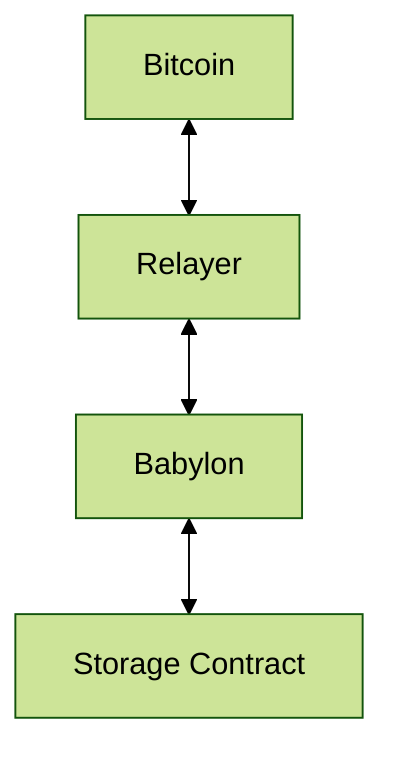

# Babylon Timestamping Demo

This presents an example of the Babylon blockchain BTC timestamping feature. Namely, using the
Babylon blockchain as a storage medium for data, that will then be time-stamped by the Babylon blockchain, using BTC as
the origin of the timestamps.

The data could be submitted to a series of verification rules, and stored if it passes it. Then, it’ll be verifiable
timestamped.

This simple case already showcases Babylon blockchain usefulness as a data availability layer, and by example, for
roll-up functionality.

## Method

For this, we’ll use a Smart Contract called `storage_contract`, deployed in a Babylon blockchain, which has the ability
to store and query data on request.

This can be thought of as a kind of Key / Value store with the bonus of being time-stamped and secured by BTC.

The API defined here is a simple API in which the hash of the data is being used as key. It can be changed /
accommodated to other use cases, like by example, having separate / independent key / value entries, or even, building
a complete storage solution with timestamps on top of it.

Any number of verification rules can be added as part of or before the data storage step.

## Block Diagram



## Infrastructure

We’ll use a Local Deployment setup for simplicity, based on the `docker-compose` setup from this repository (See
[README.md](./README.md) for details).

In this setup the Bitcoin network is being simulated, through `bitcoindsim`.

The instructions here can be adapted to run on a more generic setup like a Devnet or Testnet, and accessing one of the
existing Bitcoin testnets, like Testnet-3, Regtest or Signet.

## References

This demo depends on a number of technologies and resources:

- The Babylon blockchain itself. [BabylonChain - Checkpointing Babylon to BTC](https://babylonchain.io/blog/checkpointing-babylon-to-btc) provides a good overview of the Babylon
timestamping technology. More details can be gathered from the[Bitcoin-Enhanced Proof-of-Stake Security](https://arxiv.org/pdf/2207.08392.pdf) white paper.
- Cosmos SDK. The Babylon blockchain is developed using the [Cosmos SDK](https://v1.cosmos.network/sdk). So, this demo can serve as a reference /
introduction to Cosmos Blockchains Development and Ecosystem.
- CosmWasm. Smart Contract development for Cosmos-based chains is done using the [CosmWasm](https://cosmwasm.com/) framework. Again, this can
serve as a Quick Start guide, _not-so-gentle_ introduction to Smart Contracts development. For extra resources, check the
[CosmWasm documentation](https://docs.cosmwasm.com/) pages.
- Rust. The smart contracts of the CosmWasm framework are written in [Rust](https://www.rust-lang.org/), and compiled to [WebAssembly](https://webassembly.org/).
- Bash. Though the setup for running and deploying the services used here can be done in a number of ways, interacting
with the Blockchain and Smart Contract is done through a [Bash shell](https://www.gnu.org/software/bash/) / Command Line Interface (CLI). This has a number of
drawbacks, but the big advantage is, that it can be scripted, documented and run in an interactive session. It can then
be turned into more or less automated scripts, adapted, adjusted and modified accordingly to new requirements, etc.

## Prerequisites

Besides the requirements listed in the [README.md](./README.md) file, we’ll need to install the following for the demo:

**1. Install [Rust](https://www.rust-lang.org/tools/install) (v1.70.0 or higher)**
**2. Install CLI utils:**

- `jq` (`type jq || apt-get install jq || brew install jq`)
- `curl` (`type curl || apt-get install curl`)
- `xxd` (`type xxd || apt-get install xxd || brew install vim`)
- `sha256sum` (`type sha256sum || apt-get install coreutils || brew install coreutils`).

**2. Clone this repository:**

- [babylon-timestamping-demo](https://github.com/babylonchain/babylon-timestamping-demo).

## Demo

### 1. Init and Update Babylon, Vigilante, and the Storage contract submodules:

- [Babylon Chain](https://github.com/babylonlabs-io/babylon).
- [Vigilante](https://github.com/babylonlabs-io/vigilante).
- [storage-contract](https://github.com/babylonlabs-io/storage-contract).

```shell
git submodule init && git submodule update
```

### 2. Quick review of the `storage-contract` functionality and code

We just open an IDE and go through the main functionality of the storage contract.

### 3. Compile and Optimise storage-contract Smart Contract

Compile the contract from scratch:

```shell
cd storage-contract && cargo clean && cargo build && cd -
```

Run unit tests (optional):

```shell
cd storage-contract && cargo test && cd -
```

Compile an optimised (ready for deployment) version of the contract:

```shell
cd storage-contract && rm -rf ./artifacts && cargo run-script optimize && cd -
```

Copy optimised contract to deployment project:

```shell
cd storage-contract && cp ./artifacts/storage_contract*.wasm ../bytecode/storage_contract.wasm && cd -
```

### 4. Setup Local Deployment blockchain environment (babylon-timestamping-demo)

Launch local blockchain with simulated timestamping functionality. Starts the local deployment network, prepared for timestamping through `bitcoindsim`:

```shell
make start-deployment-timestamping-bitcoind
```

- Check docker nodes:

```shell
docker ps
```

- Check container logs (in another terminal):

```shell
docker logs -f babylondnode0
```

### 5. Install Babylon Binary

Navigate to the directory where the Babylon submodule is added, and build it:

```shell
cd external/babylon && make install && cd -
```

These commands will compile and install the babylond binary.

**4. Verify the installation**
Check that the babylond binary is correctly installed and accessible from your PATH:

```shell
export PATH=$PATH:$HOME/go/bin
```

```shell
type babylond
babylond version
```

### 4 Smart Contract deployment

- Create environment variables settings file:

```shell
cat >env.sh <<EOF
  :
  export homeDir="./deployments/timestamping-bitcoind/.testnets/node0/babylond"
  export chainId="chain-test"
  export key="test-spending-key"
  export keyringBackend="--keyring-backend=test"
  export apiUrl="http://localhost:1317"
  export rpcUrl="http://localhost:26657"
  export nodeUrl="tcp://localhost:26657"
  #export grpcUrl="localhost:9090"
EOF
```

- Setup environment variables for blockchain access (Setups babylond node 0):

```shell
. ./env.sh
```

- Store contract on chain:

```shell
babylond tx wasm store ./bytecode/storage_contract.wasm --from=$key --gas=auto --gas-prices=1ubbn --gas-adjustment=1.3 --chain-id="$chainId" -b=sync --yes $keyringBackend --log_format=json --home=$homeDir --node=$nodeUrl
```

- Get contract’s code id:

```shell
curl -s -X GET "$apiUrl/cosmwasm/wasm/v1/code" -H "accept: application/json" | jq -r '.'
```

```shell
codeId=$(curl -s -X GET "$apiUrl/cosmwasm/wasm/v1/code" -H "accept: application/json" | jq -r '.code_infos[-1].code_id'); echo $codeId
```

- Instantiate contract on chain:

```shell
babylond tx wasm instantiate $codeId '{}' --from=$key --no-admin --label="storage_contract" --gas=auto --gas-prices=1ubbn --gas-adjustment=1.3 --chain-id="$chainId" -b=sync --yes $keyringBackend --log_format=json --home=$homeDir
```

- Get contract address:

```shell
curl -s -X GET "$apiUrl/cosmwasm/wasm/v1/code/$codeId/contracts" -H "accept: application/json" | jq -r '.'
```

```shell
address="$(curl -s -X GET "$apiUrl/cosmwasm/wasm/v1/code/$codeId/contracts" -H "accept: application/json" | jq -r '.contracts[-1]')"; echo $address
```

### 5. Smart Contract interaction

- Execute `storage_contract` "store data" endpoint / handler.
- Prepare execute payload message:

```shell
data='This is example plain-text data'
dataHex=$(echo -n $data | xxd -ps -c0)
executeMsg="{ \"save_data\": { \"data\": \"$dataHex\" } }"; echo $executeMsg
```

- Execute "store data" entry point:

```shell
babylond tx wasm execute $address "$executeMsg" --from=$key --gas=auto --gas-prices=1ubbn --gas-adjustment=1.3 --chain-id="$chainId" -b=sync --yes $keyringBackend --log_format=json --home=$homeDir
```

- Query `storage_contract` "check data" endpoint / handler.
- Prepare query payload message:

```shell
dataHash=$(echo -n $data | sha256sum | cut -f1 -d\ )
queryMsg="{ \"check_data\": { \"data_hash\": \"${dataHash}\" } }"; echo $queryMsg
```

- Query "check data" entry point:

```shell
babylond query wasm contract-state smart $address "$queryMsg" -o json | jq -r '.'
```

- Confirm the presence of the data, the timestamping information, and the finalisation flag.

### 6. Tear down demo

- Stop services:

```shell
make stop-deployment-timestamping-bitcoind
```

- Remove binaries / scripts:

```shell
rm -f $HOME/bin/babylond env.sh
```

## Conclusions

That’s it! Questions?
